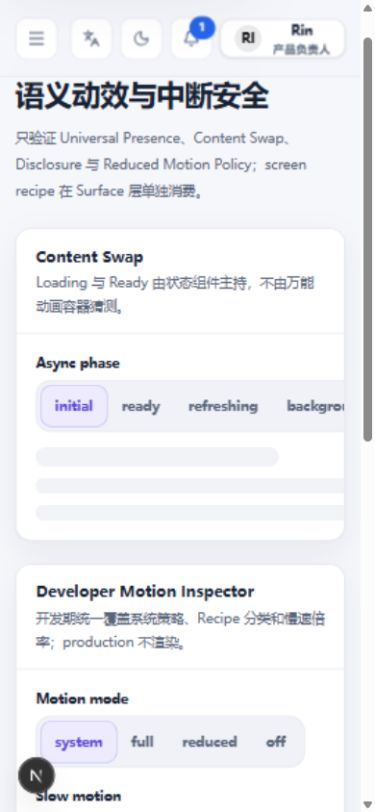

# 移动端设置、Tabs 与导航切换体验审查

日期：2026 年 10 月 7 日。访问地址：`http://127.0.0.1:4173`。本报告延续 [整体 UI UX 审查](README.md) 与 [响应式专项复核](responsive-review.md)，重点回答手机上如何快速找到设置，以及不同切换控件应如何适应有限空间。

## 1 整体评价

现有视觉语言值得保留：语义色、选中态、控件圆角、Panel 层级、页面区段、状态反馈和主题基础已经统一。手机问题集中在**任务优先级与空间边界**：桌面的导航、说明、工具栏直接上下堆叠；少数公共控件的最小内容宽度突破父容器；滚动与选中状态没有覆盖重排和尺寸变化。

优先调整组合和公共响应式契约，继续使用现有 Element、Pattern、Motion 与 i18n。设置页无需换一套视觉；Tabs 也无需全部改成 Dropdown。

需要修正“项目 Tabs 没有横向滑动”的笼统判断：**普通横向 Tabs 已有真实的 `overflow-x:auto`，实际横向滚动与键盘切换都能到达末项。** 真正不能通过横向滚动访问的是部分 ToggleGroup；此外，Tabs 在屏幕缩窄后可能隐藏当前选中项，vertical 变体的手机表现与说明不一致。[滚动与末项证据](evidence/mobile/state-tabs-end.json)、[分段选项裁切证据](evidence/mobile/segments-overflow.json)。

## 2 浏览与交互覆盖

本轮逐页加载全部 **38 个现有路由**，分别检查 320、390、430px 宽度，高度 844px，共 **114 个基础组合**。确认页面标题后读取可见布局、内部滚动范围、导航与切换控件；典型问题再以截图、点击、滚动、键盘和源码交叉验证。[全量记录](evidence/mobile/all-routes.json)。

专项操作包括：

- 设置八分类逐项点击，在三个手机宽度下记录导航和首个设置字段，共 24 个样本；另查 844×390 横屏、字段搜索和结果点击。
- 全部 10 个运行时 Tabs 实例点击最后一个可用项，核实选中项与内容面板；状态 Tabs 实际横滚、End 键到末项；英文 320px 检查六种导航展示。[交互记录](evidence/mobile/tab-interactions.json)、[英文宽度记录](evidence/mobile/english-tabs.json)。
- 七个 ToggleGroup 的宽度与选项位置，特别检查 Motion 六选项和英文三选项；在裁切区尝试横向滚动。
- 临时启用顶部页面标签，访问多个页面、点击末端标签并观察前移后的滚动位置；检查设置子路由的当前页表达。
- 2560px 选中末项、焦点进入内容面板后缩到 390px，核实选中项是否继续可见。

之前的桌面、平板、1024px 边界、英文大字号/宽松密度、短高度 Dialog/Drawer、深色和表单数据流程证据继续适用。本轮没有重跑全部状态的视觉快照或全量 Axe，手机宽度模拟也不等于真实 iOS/Android 触摸、软键盘、安全区及浏览器工具栏实测。

## 3 设置页：让内容先于分类占据首屏

### 3.1 当前空间与真实操作

手机上八个分类仍完整展开，搜索和分组分类 Panel 约 **482px 高**，其中分类导航本身约 396px。它在当前内容之前，占用超过半个 844px 视口。分类点击可以导航，但目标设置仍排在导航之后；当前分类高亮不能弥补内容不可见的问题。

390px 样本中，首个设置字段在文档中的位置如下。位置采用 `rect.y + scrollY`，避免把浏览器对焦点的自动滚动误判为布局改善。

| 分类       | 首个字段文档 Y | 对手机任务的影响                             |
| ---------- | -------------: | -------------------------------------------- |
| 外观       |          882px | 首屏先见标题、恢复操作和分类，主题控件在下方 |
| 导航       |          882px | 切换分类后还需找到开关                       |
| 数据展示   |          854px | 首个 Select 在首屏之外                       |
| 操作偏好   |          854px | 长选项卡和完整导航共同增加滚动               |
| 语言与地区 |          854px | 修改常用偏好需要越过分类                     |
| 通知       |          854px | 简单设置也承担相同导航成本                   |
| 可访问性   |         1088px | 说明进一步推迟操作入口                       |
| 快捷键     |          854px | 少量内容仍被固定规模的导航压后               |

[24 个设置样本](evidence/mobile/settings-categories.json)。横屏 844×390 下首个字段文档 Y 约 806px，增加宽度并未解决高度成本。[横屏记录](evidence/mobile/landscape-settings.json)。

搜索已有**字段级索引**，输入“字号”能得到“界面字号 / 外观”。但是结果目标只有 `/settings`，没有字段锚点；本轮点击后焦点仍在结果链接，未进入字号控件。同分类搜索尤其容易让用户觉得“点了却没找到”。分类导航也继续完整显示，因此搜索不节省导航空间。[搜索操作](evidence/mobile/settings-search.json)、[结果构造源码](../../../surfaces/plugins/settings/src/settings-layout-shell.tsx)。

### 3.2 候选模式比较

| 模式                  | 优点                                   | 当前项目的代价与适用条件                                               | 判断                                      |
| --------------------- | -------------------------------------- | ---------------------------------------------------------------------- | ----------------------------------------- |
| 左右分栏              | 分类常驻、切换快                       | 手机内容区太窄，长说明和字段受挤压                                     | 保留在空间足够的桌面；手机不用            |
| Drawer 分类           | 内容先展示，保留八分类分组与搜索       | 切换增加一次打开动作；必须有完整焦点、关闭与滚动管理                   | **推荐手机模式**                          |
| 顶部横向 Tabs         | 高频切换直接，节省高度                 | 八分类、多字标签和分组会产生隐藏项；属于路由导航，不能套内容 Tabs 语义 | 不作为设置主分类的默认方案                |
| 分类首页 → 独立设置页 | 初次探索清楚，内容页专注，适合分类增长 | 多一步进入；需保留现有深链接及浏览器返回                               | 可作为后续设置入口扩展                    |
| 折叠分类菜单          | 改动较小、无需浮层                     | 展开时仍推动内容；搜索/分类/返回状态容易相互干扰                       | 可作过渡方案，不是最佳长期方案            |
| Select / Dropdown     | 最省空间、当前类别明确                 | 分类分组和搜索上下文更弱，大集合不利发现                               | 简单类别列表可用；当前八分类更适合 Drawer |

### 3.3 推荐流程与组合

保留现有八条设置路由。手机页使用标准 Page/PageHeader，标题附近放**“当前分类 · 切换”**入口；首屏展示本分类的首个主要设置。打开 Drawer 后显示分组分类、当前分类和搜索结果，点击分类通过现有 Next 路由进入内容、关闭 Drawer，并按路由生命周期处理焦点。

搜索结果显示“字段名称 + 所属分类”，选中后定位并聚焦目标字段或其可聚焦标题；同路由结果也应执行定位。优先使用项目已有 Route Target 能力，若缺字段目标表达，再评估正式契约扩展。DOM 定位和路由提交属于 Host/明确 Browser Adapter，Plugin 提供稳定字段身份，不能在公共 Framework 中新增 pathname/history 管理。

“恢复本分类默认 / 恢复全部默认”移到明确的次级菜单或内容末端操作区，保留确认和结果反馈。搜索空结果提供清空搜索路径；不可用设置继续说明原因；持久化失败保留恢复动作。Drawer 内部独立滚动，关闭后返回触发器，ESC、遮罩、焦点约束与背景滚动由正式 Overlay 管理。

验收应以任务衡量：常见字段在标准手机首屏开始可操作；选择搜索结果后目标字段可见且有明确定位；分类入口始终可找到；浏览器返回与设置深链接保持有效。大字号和长说明下不承诺固定首屏像素位置，而要求内容优先、无裁切。

## 4 Tabs、Segment 与导航切换的全项目清点

### 4.1 不同控件保持不同语义

| 类别                                | 真实消费者                                                                      | 本轮结果                                                   | 推荐策略                                                |
| ----------------------------------- | ------------------------------------------------------------------------------- | ---------------------------------------------------------- | ------------------------------------------------------- |
| 内容 Tabs：10 实例                  | UI Navigation 六种；Status、Surfaces 各一；Create/Edit 一；Resource List 详情一 | 点击末个可用项均切换；横向变体有内部横滚；vertical 仍纵列  | 少量短项自然宽度；溢出时 A；很长、低频集合评估 C        |
| ToggleGroup：7 实例                 | Motion 四组、UI Actions 两组、UI Data 一组                                      | 单/多选语义已有；长组受外层裁切；不具备有效横滚            | 少量短单选保留分段；长单选可 C/A；多选优先 B 或多选菜单 |
| 顶部 PageTabs                       | Host 可选页面入口标签                                                           | 有横滚，但点击前移后当前项部分藏到左侧；某些子路由无活动项 | 移动评估当前页 + D；保留横滚时处理重排可见性            |
| Settings 分类                       | 八个路由、三组                                                                  | 不超宽，但占据大量纵向空间                                 | 当前类别触发器 + Drawer                                 |
| UI Elements Family 导航             | 九 Family 页同一目录                                                            | 能折行；长英文时目录明显拉长页面                           | Authority 页可保留目录；手机允许收起至当前 Family 入口  |
| Page Pattern / Archetype 目录       | 相应展示页入口导航                                                              | 基础矩阵检查已有换行，没有本轮新增的选项不可达证据         | 确保当前路由表达，按目录用途优化，不冒充内容 Tabs       |
| Pagination、Steps、Breadcrumb、Tree | Navigation Showcase 与列表/流程组合                                             | 分别承担集合页码、步骤、层级和树集合                       | 延续已有正式 Element；不可统一替换为 Dropdown Tabs      |

运行时消费者来自项目源码与 38 页的实际 DOM；不把测试用实例计入 10/7。通用入口见 [TabsView](../../../packages/ui-adapter/src/data-display.tsx)、[ToggleGroup](../../../packages/ui-adapter/src/toggle-group.tsx)、[PageTabs](../../../apps/web/src/shell/page-tabs.tsx)。

### 4.2 真实滚动能力、裁切与选中可见性

**普通横向 Tabs 能滚动。** 390px 状态预览的 TabList 可见宽度 267px、内容宽度 1110px，实际水平滚动后 `scrollLeft` 从 0 到 541；End 选择“没有访问权限”后滚至 839，末项在列表范围内，内容也正确切换。英文 320px 的 soft 四项宽度 401px / 可见 212px，仍是 `overflow:auto`，点击 Customers 能切换。禁用项保持不可选。应保留 HeroUI 的 Collection、Selection 和键盘能力。

**尺寸变化缺少选中项修正。** 2560px 所有项可见时选中末项，焦点进入 tabpanel，再缩到 390px：列表仍 `scrollLeft=0`，选中项在 x=1052～1160，而列表只在 x=54～321。内容显示权限状态，但用户看不到对应标签。[坐标证据](evidence/mobile/resize-selected.json)。

**vertical 的手机回退未实现。** 当前说明承诺窄屏顶部横向滚动，但实际 390px 仍 `aria-orientation=vertical`、`flex-direction:column`，四项占约 180px 高。布局 class 未显式覆盖 vendor 的纵向方向。实测 ArrowRight 也能切换，因此不把未经证明的键盘失效列为事实；要实现横向回退，则需同步真实方向、ARIA、键盘、指示器与布局，不能只改变 CSS。[截图](evidence/mobile/vertical-tabs-390.jpg)。

**ToggleGroup 被裁切且无法滑出剩余项。** Motion Async 六项在 390px 下约 506px 宽，外层 Section 约 341px 且 `overflow:hidden`；组本身 `nowrap/overflow:visible`，没有受限宽度的内部滚动视口。对区域横滚后滚动位置不变，后段选项仍不可见。英文 320px 的 Grid/List/Unavailable 三项也达到约 285px，末项右缘约 334px，超出父内容区。多选 Responsibility layer/Status 同样需要宽度策略。`max-w-full` 与 document 没有横向溢出都不能证明内部控件没有裁切。[英文记录](evidence/mobile/english-segments.json)。

**PageTabs 重排后当前项部分不可见。** 在手机标签条点击末端“基座能力”，它被访问顺序前移到首位，容器却保留 `scrollLeft=27`，当前项外框落在 x=-15～89，左侧被裁切。当前设置通知子路由未对应已记录入口，活动标签为空；源码只记录导航入口的精确 pathname。这需要明确“每个页面”还是“所属工作区入口”的身份规则，而不是简单扩大路径字符串匹配。[操作前后证据](evidence/mobile/page-tabs.json)。

标签标题按钮和关闭按钮实际高约 20px，关闭按钮 20×20；紧邻入口时容易误触。推荐正式触控命中区或移动端“更多页面”菜单。现有数据不足以直接认定 WCAG 间距判据失败。当前页视觉高亮之外，也应有适当的 `aria-current`。标题截断不能只靠手机不可用的 hover 获取全名。

## 5 统一响应式规范建议

### 5.1 桌面：自然宽度，但仍受容器约束

短项按内容自然宽度排列，保持项目语义间距与控件高度，不强制把少量项等分铺满宽屏。正常显示全部项的前提是容器空间足够：嵌套 Panel、长语言、徽标和大字号同样可能溢出，必须继续提供受控回退。判断依据是组件实际可用空间，不只是设备名称或 viewport 断点。

### 5.2 A/B/C/D 选择矩阵

| 方案                    | 适合                                | 当前项目推荐使用                                | 不适合与实现条件                                                                                |
| ----------------------- | ----------------------------------- | ----------------------------------------------- | ----------------------------------------------------------------------------------------------- |
| **A 横向滚动**          | 内容 Tabs、经常切换且需保留并列关系 | 普通 Tabs 默认溢出策略；状态预览、工作台详情    | 列表必须真正限宽并内部滚动；选中变化、尺寸/语言变化后保持可见；不能只隐藏溢出                   |
| **B 自动换行**          | 独立、多选且需一次看到全部选项      | ToggleGroup 多选列显示、目录链接                | 不作为 line/soft 内容 Tabs 默认；多行会移动内容、打乱选中指示；单选连体分段也不宜机械折行       |
| **C Select / Dropdown** | 多个长项、低频单选、空间非常有限    | 长模式选择；低频内容视图可评估                  | 内容选择继续是内容选择，路由选择使用正式导航；多选不能改成单选 Select；需要保留完整标签与当前值 |
| **D 常用项 + 更多**     | 稳定主次层级、很多页面入口          | 可选 PageTabs：当前页/少量固定入口 + “更多页面” | 内容 Tabs 没有真实主次时不要随意隐藏；隐藏项被选中必须显示当前名称或固定保留当前项              |

“更多”需要完整可访问名称及剩余数量，不只一个省略号；菜单中体现当前项、完整名称及可用状态。选择隐藏项后必须能辨认当前所在内容，必要时把当前项置于固定槽位。避免每次选择都重排可见项导致位置记忆失效；关闭页面的动作和切换页面应清楚区分。

### 5.3 公共契约与边界

- 将视觉 variant 与响应式策略分开：line/soft/section 继续表达视觉语义，不靠 Plugin 传 HeroUI class/slot 修正溢出。是否需要新的适配参数，先审查所有真实消费者，再登记正式 Contract。
- 单一 selected identity：Tabs/Select/更多菜单共享同一个选中值和回调；不能各维护一套状态。适配展示时保留业务草稿、验证错误与内容身份，避免布局切换引发意外重置。
- 列表与祖先链都有明确空间契约：可收缩 grid/flex item、受限宽度、适当 `min-w-0`，滚动只发生在预期的 TabList。先修根因，不用页面 `overflow:hidden` 掩盖问题。
- 选中项可见性覆盖选择、路由重排、恢复、resize 和语言变化；只移动列表，不让整个页面突然跳动。自动处理应避免持续抢回用户正在手动浏览的滚动位置。DOM 测量及生命周期放在明确 Browser Adapter/Host 边界，不散落 Feature。
- HeroUI 继续管理键盘、Focus、Selection、Collection 和 Overlay；响应式呈现不能留下与视觉方向冲突的 ARIA，也不自行复制 roving tabindex 状态机。
- 溢出提示按真实溢出状态出现。当前桌面浏览器可见滚动条，但手机系统常见的短暂滚动条不能保证持续发现；可评估轻量边缘提示/相邻项露出/可访问滚动按钮。提示不遮挡标签或 focus ring，不增加无必要的常驻箭头。
- Motion 沿用 ContentSwapTransition、Host Page Enter 与 Adapter Overlay。移动切换不再增加整页 fade；减少动效策略仍统一管理。

## 6 全站移动端问题与优先级

以下把本轮新发现与此前仍存在的主要移动问题合并排序，每项给出问题、影响和实现方向。

| 优先级 / 编号 | 当前问题与影响                                                                                       | 优化建议与推荐实现方式                                                                                             |
| ------------- | ---------------------------------------------------------------------------------------------------- | ------------------------------------------------------------------------------------------------------------------ |
| **P0 M01**    | 手机 Shell 导航缺少正式 modal 焦点约束、ESC 与背景滚动管理；键盘可进入遮罩后的内容                   | Host 装配现有正式 Drawer/Overlay，保存触发器与焦点恢复；验证打开、关闭、背景、键盘与滚动                           |
| **P0 M02**    | 短视口 Dialog 的 Footer 被裁切，取消/确认可聚焦却看不见；1024px 边界主内容落到整屏侧栏之后           | 分别修 Overlay 有限高度空间分配、Shell 边界等号冲突；不要降低阈值或添加页面补偿。此前 R01/R02 证据继续适用         |
| **P1 M03**    | Settings 分类 Panel 482px、首字段 Y≥854px，简单设置也要越过完整导航                                  | 手机当前分类触发器 + 正式 Drawer；保留路由，次级恢复操作收敛；主要修改 Settings composition                        |
| **P1 M04**    | 搜索结果有字段名称，却只导航分类；用户仍需寻找字段                                                   | 复用字段索引，增加正式字段目标/锚点及可见定位；同路由也处理；由 Host/Browser Adapter 完成滚动和焦点                |
| **P1 M05**    | ToggleGroup 长组与英文三项被裁切，横滚不能揭示余项                                                   | 公共宽度契约先修祖先 min-content；单选选择 A/C，多选 B/正式多选菜单；全部七消费者复核，不给 Motion 加特例 CSS      |
| **P1 M06**    | 普通 Tabs 缩窄后选中项在可见区外，内容与标签失去对应                                                 | Adapter 正式适配生命周期处理选中项可见；验证 resize、locale、controlled selected 和手动滚动不被抢回                |
| **P1 M07**    | vertical 手机仍四行纵列，与横向回退说明不符，消耗高度                                                | 选定真实回退契约并同步方向/可访问语义/视觉；若保留纵列，修正说明并明确适用场景                                     |
| **P1 M08**    | PageTabs 点击重排后裁切当前项，设置子路由无活动项                                                    | Host 修提交后的列表位置与入口身份；当前页添加适当语义；手机可采用 D，继续使用 Next 唯一路由                        |
| **P1 M09**    | 手机顶栏工具、完整用户信息在窄宽度/英文扩张时超宽；重复说明/目录使任务入口变深                       | Host 顶栏优先级与 compact 用户入口；Showcase 保留说明但提供收起目录；使用正常 layout utility 和已有语义组合        |
| **P1 M10**    | Field 并排 auto rows 拉伸，输入高度漂移；Switch 说明被横向挤压；设置 SearchBox grid min-content 超宽 | 公共 Element 内部轨道和 compound 内容方向修正；审查所有消费者与不同密度，避免改全局高度掩盖问题                    |
| **P1 M11**    | 工作台表格约 797px 而手机可见约 333px；横滚已存在，但选中详情在长页下方                              | 保留复杂表格横滚；手机先突出身份/状态/主动作，详情使用正式 Drawer 或现有详情路由；不要用另一套业务数据逻辑复制表格 |
| **P2 M12**    | PageTabs 关闭目标小、截断标题在手机难以补全                                                          | 正式触控命中区；更多菜单显示完整名称；切换与关闭动作分离，保留明确可访问名称                                       |
| **P2 M13**    | 溢出项的发现依赖平台滚动条，目录/说明与内容重复                                                      | 真实溢出提示、当前项固定表达、目录收起；视觉强化以现有 Token 为基础，不为“高级感”增加阴影/动画                     |

M01/M02/M09～M11 的详细复现和公共影响范围见前两份报告。M03～M08 是本轮重点深化。M05 的不可达选项当前集中在 Foundation Showcase，按 P1 排序；如果同一公共控件进入必填或关键生产流程，应按实际阻断升级为 P0。

## 7 应保留的设计与工程能力

1. **统一视觉语言**：品牌选中态、语义前景/背景、容器与控件圆角、Typography 槽位有基础，适合继续扩展，而非重新设计。
2. **语义控件分类**：Tabs 是内容切换，ToggleGroup 是偏好选择，RouteLink 是导航；分类正确，缺的是窄空间策略闭环。
3. **已存在的横滚**：普通 Tabs 与数据表局部横滚可用，Keyboard/disabled 状态保留；完善选择可见性比替换实现更合理。
4. **设置架构**：八分类路由、分组、字段搜索索引、即时预览、分类与全局恢复已经具备，能支持 Drawer 和字段定位。
5. **公共边界与同源展示**：HeroUI 收口、Page/Pattern、Motion 和 Store ownership 能承接改进；Showcase 发现的问题应修同一公共实现。
6. **克制动效与宽度治理**：语义 Motion、统一最大内容宽度、多数页面换行与 Drawer 内滚动已经发挥作用。

## 8 实施顺序与验收

建议先处理 P0 的访问、焦点和有限高度，再处理 ToggleGroup 与 Tabs 公共空间/可见性，随后完成设置导航和字段定位、PageTabs、顶栏与数据任务组合。最后增加溢出提示与触控细节。公共改动前检查消费者、TailAdmin 对应具体页面和当前 UI authority，再走 Contract、Showcase、A11y、Responsive/Dark/Content 与门禁；本报告不修改当前 authority。

建议回归矩阵包括 320/390/430、844×390、768、1023/1024/1025、1440 与超宽屏；中文/英文、长标签、徽标、大字号、三密度、深色、减少动效、受控选中、禁用项、动态增减和 PageTabs 关闭重排。真实手机另补触摸横滚、软键盘、动态工具栏、安全区与返回手势。

验收重点：所有选项可达且标签可辨；切换面板与当前项一致；尺寸变化不丢当前项、不重置草稿、不拉动整页；浮层按钮始终可见；导航关闭恢复焦点；全页不靠裁切掩盖控件溢出。真实手机任务走查应覆盖“改字号”“搜到设置”“切换末项”“打开/关闭页面”“查看列表详情”，而非只检查首页截图。

## 9 证据、检查与交付边界

- [Tabs 起始截图](evidence/mobile/state-tabs-start.jpg)、[末项截图](evidence/mobile/state-tabs-end.jpg)：内部滚动与状态内容。
- [vertical 手机截图](evidence/mobile/vertical-tabs-390.jpg)：实际纵列回退。
- [英文分段截图](evidence/mobile/english-segments-320.jpg)：短组也受到语言扩张影响。
- [页面标签重排截图](evidence/mobile/page-tabs-reorder.jpg)：重排后当前项的左侧裁切。
- [缩窄后选中项记录](evidence/mobile/resize-selected.json)：列表与当前项的坐标比较。

截图是浏览器审查证据，不是允许自动更新的视觉基线；部分截图存在捕获缩放/压缩软化，不将其计为产品字体缺陷。

本轮新增报告和证据，未修改产品实现。临时语言和顶部页面标签已恢复为中文、关闭状态，标准字号/密度与系统主题保持，视口覆盖已重置；浏览操作产生的会话标签及最近访问记录可能仍在。

交付检查结果见 [本轮门禁日志](evidence/mobile/pnpm-check.log)。Foundation、Architecture、Dependency 与两项 Codegen 检查通过；`pnpm check` 在既有 ESLint 问题处停止，共101个错误、13个警告，未进入后续类型/测试/构建/浏览器步骤。四份变更文档的格式检查通过，本报告本地链接目标全部存在。此前检查的类型与单元测试通过不代表本轮完整门禁通过。
