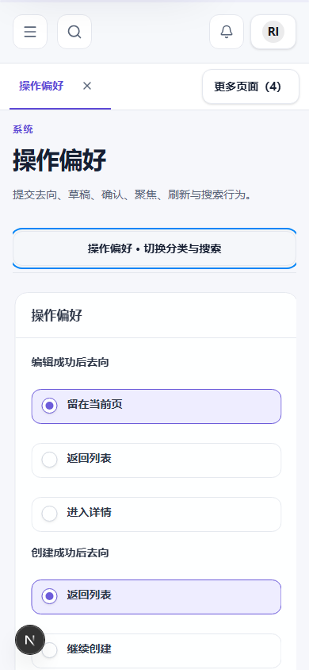

# 2026-10-08 第二轮验证与中断恢复

## 当前终态

完整命令已结束，恢复时原执行句柄不存在，日志已有明确最终结果，没有悬挂测试。
代码尚未提交；没有自动更新视觉基线或改动截图阈值。恢复时4173没有监听，重新启动开发服务
用于最后浏览器确认。此项不重复已有审查或全量测试。

| 检查                                   | 当前证据与结果                                                                                    |
| -------------------------------------- | ------------------------------------------------------------------------------------------------- |
| Foundation / Architecture / Dependency | [完整日志](review-check-final.txt)，通过                                                          |
| Plugin / Design codegen freshness      | 同上，通过                                                                                        |
| ESLint / TypeScript                    | 同上，通过                                                                                        |
| 单元测试                               | 同上，370项通过                                                                                   |
| Next生产构建                           | 同上，通过                                                                                        |
| 原产物预算                             | 同上，通过；最大路由gzip 432922 B，原上限未改变                                                   |
| 完整浏览器回归                         | 同上，233项：219通过，14视觉用例失败；27个失败断言全部是截图比较                                  |
| 设置与公共控件专项                     | [独立日志](review-browser-final.txt)，15项通过；最新完整运行也覆盖了颜色一致性检查                |
| 原有排列测试修正                       | 检查点击Content内真实布局，非要求无交互职责的Field外层横排；[首次补跑](review-indicators.txt)通过 |
| 格式 / 文档                            | 完整链在视觉门停止，独立执行；[格式](review-format.txt)、[文档](review-docs.txt)                  |

## 尚未闭合的验收

[27组视觉对照](review-2026-10-08/visual-differences/index.html)包含现有基线、最终实际与差异图。
本轮设置行高度/Section、Switch与选项点击表面、Checkbox颜色产生预期变化；其它画面还包含
109前轮未批准的变化。不得将全部差异简单归因于本轮或环境，也不得直接批准整批快照。
需要人工确认这些具体画面后才能更新对应基线并重新执行完整检查。

移动端证据覆盖320/390/430/768/1024/1279、多个滚动位置、分类连续切换、搜索上下文、Back恢复、
触摸模拟、固定与非固定标签。共享回归覆盖深色英文大字三种密度、关键Reference、浮层键盘/焦点
与WCAG AA。真实设备拇指触达、软键盘、安全区和屏幕阅读器没有实机证据，不宣称已通过。

## 可复核画面

以上截图展示最终分类切换后的上下文、顶部标签与分类入口；长页多位置行为由专项断言证明。
详细问题根因、影响与方案比较仍在[108原报告第12节](../../108-ui-ux-audit/README.md#12-2026-10-08-二次审查设置任务选择热区与页面标签)。

## 目标逐项验收

| 用户要求                                      | 当前实现与对应证据                                                                              | 判定                     |
| --------------------------------------------- | ----------------------------------------------------------------------------------------------- | ------------------------ |
| 标签默认固定、设置可选非固定、与Header衔接    | pageTabsPinned默认补全、Host统一sticky与高度测量；专项固定/非固定、刷新与六级窄屏任务           | 代码与行为通过           |
| 标签视觉主次、触摸发现、溢出管理和反馈        | quiet关闭、hover/focus增强、触摸保持入口、独立管理菜单、当前项定位与关闭焦点；专项桌面/触摸流程 | 行为通过，画面待确认     |
| 设置密度与控件布局                            | row/rows composition和正式Section；三密度、英文大字与窄屏回归                                   | 行为通过，画面待确认     |
| Switch/Radio/Checkbox真实热区、键盘、禁用语义 | 公开Content包含控制、文字和可选表面；名称/说明分离；DOM契约、实际点击/Space/方向键与Axe         | 通过                     |
| 特殊信息组件语义与来源                        | 保留可访问性同源摘要，正式RouteLink替换失效fragment；分类往返专项                               | 通过                     |
| 手机首次理解分类、长页连续任务、多位置切换    | 当前类别入口与三组Drawer；六视口、650/1600/3000px位置、通知→可访问性→外观→操作偏好              | 模拟验证通过             |
| 导航上下文与滚动状态                          | 同分类保留位置、搜索词保留、字段定位和原生Back恢复；无第二Router或持久化scrollY                 | 通过                     |
| 独立比较移动方案并作架构决策                  | 原报告12.2比较索引详情、横向Tabs、底部栏/Sheet与持续入口；采用既有Drawer和Host空间Port          | 已记录并实施             |
| 扩展检查与共性规范                            | 公共控件根因修复、方向进入溢出收口、UI/Surface authority更新；完整Reference/Overlay/Family回归  | 行为通过，整体视觉待确认 |
| 更新原报告、优先级与完成状态                  | 原108第12节含9项确认问题、P1/P2与实现状态；109账本明确历史/本轮结果                             | 已完成                   |
| 执行pnpm check并修复根因                      | 完整运行结束；非视觉失败已修复，剩14个视觉用例/27组差异，不放宽门禁                             | 已执行，尚未全绿         |
| 交付前视觉基线确认                            | 27组expected/actual/diff均存在，已验证无缺失；AGENTS第10节要求人工确认后更新                    | 等待人工确认             |

本表区分代码完成、行为证据和最终视觉验收，不将模拟测试扩张为真实设备结论。

## 设置容器与动态布局最终复核

当前代码修复R13-01/02/03，原报告第13节记录完整根因、方案与范围。恢复时服务仍在运行，
原命令已经结束；保留前轮修改，没有从头重做审查。

- 完整最终代码检查：layout-check-final.txt。370单元通过；236浏览器222通过、14视觉失败。
- 27个错误全部为toHaveScreenshot；治理、依赖、生成物、lint、类型、构建、预算通过。
- 原maxRoute预算440320B，实际432922B；未修改任何预算或截图阈值。
- 原快照未更新；最终27组expected/actual/diff均完整复制到review-2026-10-08/layout-visual-differences/index.html。
- 新专项覆盖五种宽度×三种Tabs状态、长页滚动、共享SplitView、低高度桌面末项键盘选择；既有手机连续操作、深色英文Axe、触摸模拟、Back与搜索上下文保留。
- 全量执行后仅补充短窗口截图等待目标Section显示的断言，并按视觉测试惯例关闭捕获时的进入动画，生产实现未再改变；专项结果见layout-browser-final.txt。
- 最后专项17项全部通过（48.8s），截图稳定化后单项重新通过（layout-short-window-final.txt）。测试文件lint、格式门与文档门均通过；最终画面不包含过渡中的空白正文。
- pnpm check仍exit 1；人工视觉确认未完成，不能声明完整验收或自动更新基线。
- 浏览器原生缩放、真实设备、软键盘、原生安全区与读屏未验证，不扩大模拟证据范围。

## 当前目标完成审计与原生缩放限制

续审时再次确认4173服务仍在运行，最终代码检查与17项专项均已终止，没有待恢复测试。
内置浏览器在614×616视口尝试Ctrl+-后，innerWidth/innerHeight、devicePixelRatio=1与
visualViewport.scale=1均未改变；Ctrl+0恢复后状态一致。浏览器公开能力只有visibility和
viewport，没有原生zoom控制。此操作没有构成原生缩放测试通过的证据；不以CSS zoom、
设备比例或缩小viewport冒充浏览器zoom。代码未因此修改，未重复完整测试。

| 当前目标要求                               | 权威证据                                                                           | 判定                               |
| ------------------------------------------ | ---------------------------------------------------------------------------------- | ---------------------------------- |
| 容器语言、主次、现有Card/Panel/Section复用 | 原108第13.1节、settings SectionShell的outlined/contentInset、最终对照25-actual.png | 已实施并复核                       |
| 避免重复外壳、独立样式和公共默认污染       | Plugin仅组合已有Section；Drawer内仍embedded；Panel/Section公共默认未修改           | 已完成                             |
| Header/Tabs/导航的布局及滚动关系           | AppShell单一ResizeObserver；派生变量在sticky消费者计算；原108第13.2节              | 已完成                             |
| Tabs显示/隐藏、固定/非固定即时更新         | 5种宽度×3状态动态专项、15张layout画面、持久化专项                                  | 通过                               |
| 顶部/中段/底部与连续分类任务               | layout-browser-final.txt中的17项，既有六宽度长页位置/Back/搜索/触摸覆盖            | 通过                               |
| 桌面/平板/手机和窗口尺寸变化               | 320至2560宽、1440×500低高度末项键盘选择与resize覆盖                                | 模拟验证通过                       |
| 其他共享sticky消费者及现有功能             | SplitView独立专项、236项完整回归中的非视觉断言、370项单元                          | 行为通过                           |
| 更新原报告、根因、优先级、方案与范围       | 原108第13节、109任务账本、当前验证记录                                             | 已完成                             |
| 原生浏览器缩放                             | 当前IAB快捷键未改变缩放，公开能力无zoom；未获得普通浏览器实测                      | 未验证，需外部可控浏览器或人工证据 |
| pnpm check完整通过与视觉验收               | layout-check-final.txt：14视觉失败；27组完整对照；AGENTS第169行                    | 未完成，等待人工确认视觉变化       |

人工复核入口为review-2026-10-08/layout-visual-differences/index.html。需要确认27组变化
合理后才能更新对应基线；原生缩放需要在支持真实zoom的浏览器中验证75%/125%/200%下的
三种Tabs状态及长页分类切换。其余已通过项目无需再次从头执行。

## 验收反馈R14-01：row悬停背景与内容留白

默认Card没有修改，row使用已有px-3/py-2，Content仍拥有单一点击热区。UI Elements表单
权威补充同源示例；修改前复核全部消费者及TailAdmin Form Elements的选择状态和空间关系。
实际浏览器从左右0px修正为12px，右侧控件亦距背景边缘12px。测试不把键盘焦点轮廓混作
hover画面，先验证Space后清除键盘焦点，再以真实hover捕获。

- 完整检查hover-spacing-check.txt：370单元通过；237浏览器223通过、14视觉失败，27个错误全部toHaveScreenshot。
- 设置专项18项全部通过。新增hover专项15.4s，覆盖1440/390/320×紧凑/标准/宽松；测量内部边距，点击新增留白，Space恢复原值。
- 架构、依赖、生成物、lint、类型、构建与预算通过。maxRoute gzip432952B，原上限440320B。
- 九张画面保存于review-2026-10-08/switch-row-hover-{width}-{density}.png；最终27组完整对照在review-2026-10-08/hover-visual-differences/index.html。
- pnpm check因截图比较exit 1；原快照、阈值与预算未更新。用户指出一项缺陷不等于批准全部旧变化；原生zoom能力限制仍保留。

## 环境恢复与设置语义续审

2026-10-08已确认命令、读取、项目内临时文件写入/读取/删除及浏览器恢复。
本轮保留既有代码、审查和快照，新增内容见108 §18、109任务账本。

- Web单元测试采用Vitest官方native配置加载与threads池，24文件126项通过（7.77s）；其中公共交互专项7项。未调整断言、覆盖范围或超时。
- apps/web与surfaces类型检查通过；新增Host/Feature/Adapter代码lint通过；架构505源文件、治理12工作区/11owner通过。
- 设计生成物freshness、相关文件Prettier和文档入口检查通过，git diff --check通过。
- 真实浏览器验证颜色刷新保存、方向键选择、320大字号、1440/390英文、减少动效、浅/深色高对比度、通知成功提示、日期时间即时格式与文本截断/换行。
- 分类切换从外观页scrollY=1168进入通知页，修复后scrollY=0、标题top124、Header bottom80；焦点返回分类入口。
- 新增settings-semantic.spec.ts含三视口语义/Axe及移动滚动偏好回归，已类型检查，尚未运行断言。
- 再次pnpm check因用户目录pnpm锁拒绝访问失败；直接Playwright worker fork仍spawn EPERM。不是应用断言失败，不能使用历史构建/预算/浏览器成绩代替本轮全量验收。

剩余：完整构建/产物预算、完整浏览器/Axe矩阵、所有共享控件高对比度状态组合、系统more模拟、关闭滚顶偏好分支自动化及旧视觉对照人工验收。
next-env.d.ts由当前Next开发运行时生成了.next/dev类型引用，本轮没有手写该生成物；生产构建需重新核验生成路径。
